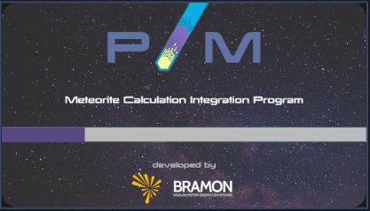
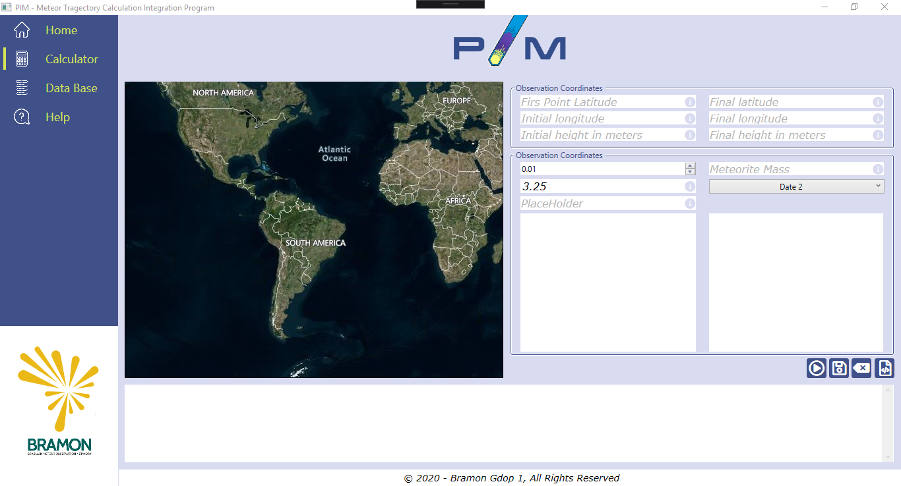
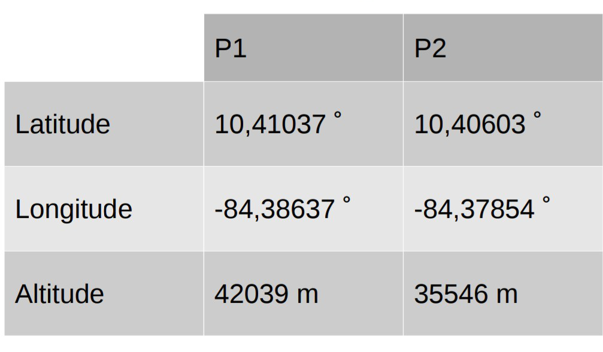

# PIM - PROGRAMA DE INTEGRAÇÃO DE CÁLCULO DE TRAJETÓRIA DE METEOROS

## Participantes

- Ana Carolina G. de Oliveira
- Bárbara C. B. Camargo
- Brewerton T. O. dos Santos
- Daniela Mourão
- Eva D. A. L. Barbosa
- Lucas G. D. Bittencourt

## Instituições

- Faculdade de Tecnologia de São Paulo, FATEC, Guaratinguetá (SP), Brasil
- Universidade Estadual Paulista, UNESP, Guaratinguetá (SP), Brasil

E-mail: bcbc.fisica@gmail.com

## Resumo

Atualmente a rede de colaboração Bramon (Brazilian Meteor Observation Network) tem obtido uma grande quantidade de dados em suas mais de 100 estações espalhadas pelo Brasil. Apesar da quantidade de colaboradores a volumosa quantidade de dados dificulta a análise pelos profissionais. O grupo de dinâmica orbital e planetologia (GDOP-UNESP) tem trabalhado com alguns desses dados utilizando alguns programas para o cálculo de trajetória desses objetos. Estes programas calculam a trajetória dos meteoros quando entram na atmosfera e uma possível região de queda. Além disso também calculamos a possível origem desses objetos. Numa tentativa de democratizar a utilização desses programas foi proposto a criação de um software com uma interface gráfica e intuitiva. A proposta é disponibilizar esse software para outras estações e redes de monitoramento podendo assim facilitar a coleta de matérias dos materias que atingem o solo.

## Introdução

A Terra é bombardeada por cerca de 6 mil meteoros todos os anos, porém monitorar todo esse material é muito complicado. A Rede Brasileira de Monitoramento de Meteoros (BRAMON - Brazilian Meteor Observation Network) é uma organização aberta e colaborativa, mantida por voluntários sem fins lucrativos cuja missão é desenvolver e operar uma rede para o monitoramento de meteoros. Ela também tem como objetivo, produzir e fornecer dados científicos à comunidade através da análise de suas capturas, que são realizadas por estações, de monitoramento, em sua maioria de baixo custo, mantidas por seus membros.
Os dados coletados são disponibilizados para todos os membros da rede, porém a análise tem sido defasada devida a quantidade volumosa de dados obtidos. Devido essa dificuldade o Grupo de Dinâmica Orbital e Planetologia (UNESP) e alunos da Faculdade de Tecnologia (FATEC) propuseram a criação de um software de interface gráfica para ajudar no rastreamento de possíveis meteoritos.
O software PIM (PROGRAMA DE INTEGRAÇÃO TRAJETÓRIA DE METEOROS) possibilita a entrada de dois dados de posição (latitude, longitude e altura) em um intervalo de tempo do objeto capturado pelas câmeras e traça uma possível região de queda. Além disso é possível fazer a integração reversa, descobrindo a possível origem no sistema Solar do objeto.
Desenvolvido com o intuito de fazer a integração de scripts já existentes para cálculos de região de queda e integração reversa, criados na linguagem Fortran, utiliza-se os scripts Model3D.for e Kepler2.for.
O sistema é desenvolvido utilizando C# WPF, o PIM busca facilitar esses cálculos de forma que o usuário possa fazer todos os procedimentos integrados dentro de uma única plataforma, de forma fácil e rápida imputando algumas poucas informações. O PIM conta um design simples, amigável e intuitivo e ele também possui um banco de dados que é possível encontrar as informações de cálculos já feitos anteriormente.

## Telas do Sistema

Ao iniciar o sistema você verá uma pequena tela de carregamento igual a imagem 1.

- SplashScreen

Na tela de cálculo (imagem 2) é necessário imputar as coordenadas corretas de latitude, longitude e altura inicial e final, também é necessário informar a massa do meteoro dependendo do tipo de cálculo que será feito e selecionar o tipo de cálculo que deverá ser executado. Também é possível ter acesso a algumas funcionalidades como botão1, botao2, botão3 e verificar os scripts dos cálculos em Fortran.

- Tela de Cálculo

## Casos de Uso

- Case 1:

Em abril de 2019 houve a queda de meteorito na Costa Rica houveram muitas buscas com poucos resultados, com a utilização dos scripts foi possível facilitar essa busca, através de cálculos foi possível traçar uma melhor localização da queda facilitando o trabalho dos pesquisadores e comunidade cientifica que utilizavam as informações da BRAMON.

Tabela 1 – Pontos Obtidos na Trajetória do Meteoro (Costa Rica)

## Referências

CHAMBERS, J. E. A Hybrid Sympletic Integrator that Permits Close Encounters between
Massive Bodies. Monthly Notices of the Royal Astronomical Society, 304, 793. 1999.
MURRAY, C.D., Dermott, S.F. Solar System Dynamics. Cambrige University Press. 1999.

## Agradecimentos

FAPESP, Capes e CNPq pelo apoio financeiro a este trabalho.

<table>
    <tr>
        <td style="text-align:center">
            <a href="https://github.com/lucasgdb" target="blank" rel="noopener"> @lucasgdb</a>
        </td>
        <td style="text-align:center">
            <a href="https://github.com/BrewertonSantos" target="blank" rel="noopener"> @BrewertonSantos</a>
        </td>
        <td style="text-align:center">
            <a href="https://github.com/bcbcfisica" target="blank" rel="noopener"> @bcbcfisica</a>
        </td>
        <td style="text-align:center">
            <a href="https://github.com/krolgon" target="blank" rel="noopener"> @krolgon</a>
        </td>
    </tr>
</table>
